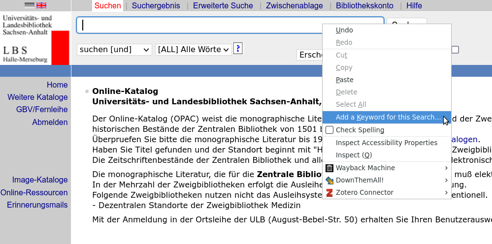

# Plan

Zusammenstellung von Informationen zur digitalen Bibliotheksarbeit.

Es werden nur öffentlich zugängliche Ressourcen verwendet.[^2]
Der Schwerpunkt liegt auf dem GBV und hier insbesondere bei der ULB Sachsen-Anhalt.
Die Inhalte sollten sich aber mehr oder weniger leicht auf andere Anwendungsfälle adaptieren lassen.

Sehr nützlich ist der [Kurs von Felix Lohmeier](https://felixlohmeier.gitbooks.io/kurs-bibliotheks-und-archivinformatik/content/kapitel-3/32-ubertragungsprotokolle-sru-und-oai-pmh.html). 
Vgl. auch die Tutorials der [DNB](https://www.dnb.de/DE/Professionell/Services/WissenschaftundForschung/DNBLab/dnblab_node.html).

# Aufbau

## Praktische Tipps zur effizienteren Gestaltung der eigenen Arbeit:

### Firefox als CBS 'light' mit Hotkey-Funktion

1. Rechtsklick in das Eingabefeld, das über die Adressleiste des Browsers angesteuert werden soll.



2. Festlegung eines Keywords (z.B. 'hopac')

3. Speichern

4. Jetzt kann im der Adressleiste des Browsers das Keyword und ein Suchbefehl eingegeben werden, z.B. `hopac Einführung Musik` oder auch mit entsprechenden Suchschlüsseln `hopac per Müller tit einführung`

### Komplexe Suchanfragen als Link

Um komplexe Suchanfragen mit anderen zu teilen oder um bestimmte Abfragen wiederholt durchzuführen, empfiehlt es sich, die Abfrage als Link zu speichern.

Beispiele für vorgefertigte, komplexe Suchanfragen im OPAC (Bsp. auf der [FID-Seite](https://www.menalib.de/vifa/systematik-des-fid-nahost-nordafrika-und-islamstudien/)):
  - physischer Bestand der Ha18 (ZwB Steintor-Campus der ULB Sachsen-Anhalt): Query `sst ha 18 and bbg A*` <https://lhhal.gbv.de/DB=1/CMD?ACT=SRCHA&SRT=YOP&TRM=sst+ha+18*+and+bbg+A*>

Einen Überblick über die häufigsten Index-Typen und Such-Schlüssel bietet z.B. das Schulungsmaterial im K10Plus-Wiki, [Folie 36](https://wiki.k10plus.de/download/attachments/203128864/K10plusKatalogisierungsschulung-Teil1.pdf).

### Neuerscheinungen im Blick durch RSS-Feeds

Viele Blogs, Verlage und Bibliothekskataloge bieten die Möglichkeit, einen RSS-Feed einzurichten. Für das Ha:Lit-Discovery System der ULB Sachsen-Anhalt vgl. [meinen Blog-Beitrag](https://learnit.bibliothek.uni-halle.de/2021/03/bleiben-sie-immer-auf-dem-laufenden-mit-rss-feeds/).
Einige bibliothekswissenschaftlich relevante RSS-Feeds habe ich [in diesem github-Repository](https://github.com/alexander-winkler/lisrss) gesammelt.

Für Neuerscheinungen im deutschsprachigen Bereich empfiehlt es sich, die entsprechende Suchanfrage als RSS-Feed zu abonnieren (Tipp von [Philipp Zumstein auf Twitter](https://twitter.com/zuphilip/status/1324754044741734400)).
Romanistische Neuerscheinungen (Hauptsachgruppen 440, 450 und 460) können z.B. [über diesen Link](https://portal.dnb.de/opac.atom?currentResultId=hsg+all+%22440%22+or+hsg+all+%22450%22+and+hsg+all+%22460%22%26any&method=search) abonniert werden.

### Effizientes Arbeiten mit E-Mails

E-Mails sind trotz alternativer Chat- und Messenger-Lösungen ein zentrales Kommunikationsmedium.

#### Wiedervorlage

Nicht alle Mails erfordern eine unmittelbare Aktion.
Vielmehr kann es sinnvoll sein, Mails auf Wiedervorlage zurückzustellen.

Die geht in Thunderbird z.B. mit dem Tool [mailmindr](https://mailmindr.net/en//).
Hier lassen sich für einzelne Mails benutzerdefinierte Erinnerungen einrichten oder z.B. zu einem gegebenen Zeitpunkt als als ungelesen markieren.

### Anmerkungen zu Mails

Kurze Hinweise zu Mails lassen sich über das Add-on [XNote++](https://github.com/xnotepp/xnote/wiki) hinzufügen.

### Verzögertes Versenden einer Mail

Sollten Mails erst zu einem bestimmten Zeitpunkt in der Zukunft verschickt werden, kann dieser mit dem [Send Later](https://github.com/Extended-Thunder/send-later/) bestimmt werden.

## Schnittstellen zu Datenbanken

- Übersicht der Datenbanken des GBV: <http://uri.gbv.de/database/>
- Bibliothekskataloge des GBV: <http://uri.gbv.de/database/opac>
- Halle:
  - Universitätsbibliographie: <https://uri.gbv.de/database/hb-halle>
  - Bibliothekskatalog: <http://uri.gbv.de/database/opac-de-3>

Weitere Schnittstellen:

- [DAIA](https://verbundwiki.gbv.de/display/VZG/DAIA)
- [PAIA](https://verbundwiki.gbv.de/display/VZG/PAIA)

Informationen hierzu: <https://verbundwiki.gbv.de/display/VZG/Schnittstellen>

## Zeitschriftendatenbank

<https://www.zeitschriftendatenbank.de/services/schnittstellen/sru/>

## SRU-Syntax

Einen Überblick über die erlaubten Such-Indizes bietet die `explain`-Funktion der SRU-Schnittstelle:

```
curl "http://sru.gbv.de/hb-halle?operation=explain" | xmllint --xpath "//*[local-name()='index']/*[local-name()='title']/text()" -
```

Erläuterungen zur SRU-Schnittstelle des K10Plus bietet das [K10Plus-Wiki](https://wiki.k10plus.de/display/K10PLUS/SRU)

Als Suchparameter für die SRU-Schnittstelle stehen zur Verfügung:

| Key                     | Value                                                                          |
| ---                     | ---                                                                            |
| `version`               | `1.1`/`1.2`                                                                    |
| `operation`             | `searchRetrieve`/`explain`                                                     |
| `query`                 | `pica.<SUCHINDEX> = <WERT>` (konkatenierbar mit `and`)                         |
| `maximumRecords`        | *integer* (maximale Zahl = 100)                                                                     |
| `recordSchema`          | `picaxml`, `marcxml`, `dc` [etc.](https://wiki.k10plus.de/display/K10PLUS/SRU) |
| `startRecord`           | *integer*                                                                      |
| `sortKeys` (SRU v. 1.1) [^1]| `year,,1` (aufsteigend), `year,,0` (absteigend)                                |


## Abfrage über SRU-Syntax

Abfrage erfolgt über HTTP-Request. 
Ein Funktion, die die Ergebnisse einer Titelsuche ausgibt:

```python

import requests

def opac_query(tit: str, maxRec = 100, startRec = 1) -> 'requests.models.Response':
  endpoint = "<DATENBANK-URL>"
  params = {
          'version' : '1.1',
          'operation' : 'searchRetrieve',
          'query' : 'pica.tit = {tit}',
          'maximumRecords' : maxRec,
          'startRecord' : startRec,
          'recordSchema' : 'picaxml'
  }
  resp = requests.get(endpoint, params = params, timeout = 10)
  return resp

```

`maxRec` und `startRec` sind per default auf 100 bzw. 1 eingestellt.
Es bietet sich jedoch mit Blick auf die Iteration an, sie in der Funktion als Variablen zu deklarieren und ggf. jeweils benötigte Werte zu übergeben.

Für iterative Abfragen empfiehlt es sich unbedingt, ein `timeout` zu definieren, da `requests.get` standardmäßig beliebig lange auf eine Antwort wartet und das Programm damit einfriert.

## Iterative SRU-Abfrage

Die SRU-Schnittstelle gibt nur 100 Datensätze pro Abfrage aus.
Um mehr als 100 Daten über die SRU-Schnittstelle laden zu können, muss ein iterativer Prozess initiiert werden.

Hierfür ist zunächst die Treffermenge zu ermitteln.
Die Treffermenge wird in der Antwort der SRU-Schnittstelle standardmäßig übermitteln.
Es muss also das 'numberOfRecords'-Feld der resultierenden picaxml-Datei ausgelesen werden:

Zunächst wird mit der oben definierten Funktion eine Anfrage an die Datenbank gestellt.
Da nur die Gesamttrefferzahl benötigt wird, kann `maxRec = 1` gelten.
Die Abfrage benötigt bei kleinerem `maxRec` weniger Zeit.

```python
resp = opac_query('Einführung', maxRec = 1)
```

Dann wird die Ergebnis-XML geparset und das `numberOfRecords`-Feld ausgelesen:

```python
from lxml import etree

def hits(resp:'requests.models.Response') -> int:
  tree = etree.fromstring(resp.content)
  hits = tree.find('{http://www.loc.gov/zing/srw/}numberOfRecords').text
  return int(hits)

```

Die Iteration muss nun von `startRec = 1` bis `startRec = hits(resp)` mit `step = maxRec` durchgeführt werden (genauer: `startRec + (hits(resp) // maxRec) * maxRec).

Die relevanten Ergebnisse sind die `record`-Knoten der resultierenden Pica-XML.
Diese können zu einer Python-Liste oder einem xml-Ergebnisbaum zusammengefasst werden.

```python

records = []

for i in range(1, hits(resp), 100):
    resp = opac_query('Einführung', startRec = i)   
    tree = etree.fromstring(resp.content)
    record_nodes = tree.findall('.//{info:srw/schema/5/picaXML-v1.0}record')
    records.extend(record_nodes)
```

`records` enthält jetzt eine Liste aller ElementTree.Elements der Ergebnis-Knoten.

# Arbeit mit PicaXML

Im PicaXML-Format sind die Daten seriell in `datafield`- und diesen untergeordneten `subfield`-Knoten organisiert. `datafield`-Knoten haben ein `@tag`-, `subfieldKnoten ein `@code`-Attribut.
Die möglichen Werte entsprechen dabei den Pica+-Feldern, wie sie in der [K10plus Format-Dokumentation](https://format.k10plus.de/k10plushelp.pl?cmd=pplist&katalog=Standard&val=-1&adm=0) dokumentiert sind.

Ein Record aus oben generierter `records`-Liste lässt sich somit auf folgende Weise auslesen:

```python

for r in records:
    ppn = r.find("{info:srw/schema/5/picaXML-v1.0}datafield[@tag='003@']/{info:srw/schema/5/picaXML-v1.0}subfield[@code='0']").text
```

Handelt es sich um wiederholbare Felder, gibt es also mehr als ein Feld mit demselben `@tag`-Attribut, muss die `findall`-Methode verwendet werden:


```python

for r in records:
    authors = r.findall("{info:srw/schema/5/picaXML-v1.0}datafield[@tag='028C']/{info:srw/schema/5/picaXML-v1.0}subfield[@code='a']")
    authors = [aut.text for aut in authors]
```

Letzter Code-Snippet erzeugt eine Liste der Nachnamen der "2. und weitere[n] geistige[n] Schöpfer" ([Feld 3010](https://format.k10plus.de/k10plushelp.pl?cmd=kat&val=3010&katalog=Standard)).


[^1]: Bei SRU v. 1.2 erfolgt Sortierung durch CQL-Befehl, also durch Hinzüfügung von `sortby year =descending` zum Query-String.

[^2]: Während die Frage der "Freigabe von Daten aus Bibliothekskatalogen" im Detail komplex ist (vgl. @ZQVAI4W4#Kreutzer_2011), sollten die über die SRU-Schnittstelle ausgegebenen Daten gemeinfrei sein. Vgl. etwa den Hinweis auf der [*Coding Da Vinci*-Seite der VZG](https://verbundwiki.gbv.de/display/VZGVers/Coding+da+Vinci). Wünschenswert wäre es, wenn die Anbieter:innen der Katalogdaten die Nutzungslizenzen deutlich sichbar und unmissverständlich angäben. Der [EDIT16](http://edit16.iccu.sbn.it/web_iccu/ihome.htm) steht z.B. unter einer CC-BY-Lizenz und kann daher entsprechend nachgenutzt z.B. [in ein leichter handhabbares Format überführt](https://github.com/alexander-winkler/EDIT16) werden.
